# 2022秋《操作系统》课程实验报告实验-0

20301174-万兴全

已推送到[VanXQ/VanOS at lab0 (github.com)](https://github.com/VanXQ/VanOS/tree/lab0)

## 一、实验步骤 

本实验的主要目的是配置操作系统开发的基本环境。


1. 准备实验基础平台

实验基于docker和openEuler操作系统进行。需要首先在自己的系统上安装配好docker，请自行参考：https://www.docker.com/。

获取openEuler的docker镜像，执行如下命令：

```sh
docker pull openeuler/openeuler
```

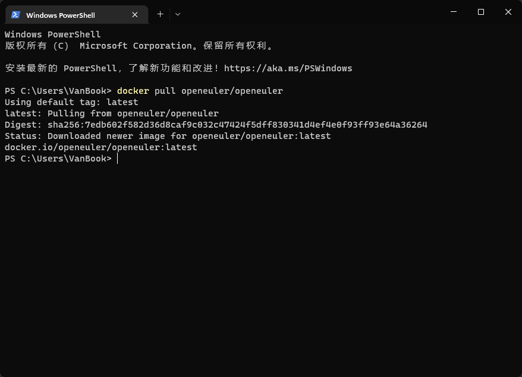

2. 创建本地开发目录

注意本地指的是自己的机器，不是docker的容器。

```sh
mkdir ~/GardenerOS/
```

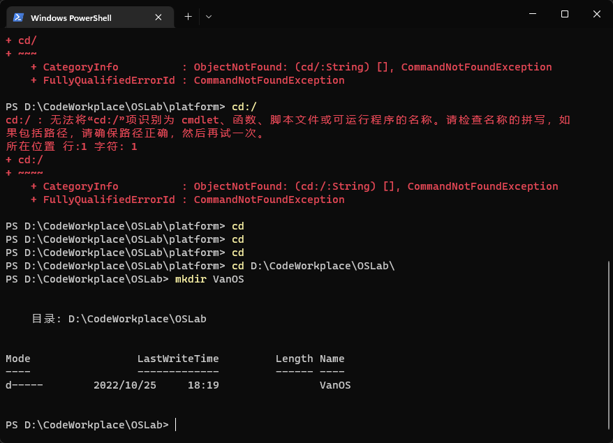

实验要求利用版本管理工具git对代码进行管理。关于git的使用请自行学习。

需要执行如下git相关的操作：

```sh
git init
touch .gitignore
git add .
git commit
git remote add 你的git远程目录
git push --all
# 这个简单，暂不做演示
```

3. 创建自己的docker镜像

在自己创建的实验目录下执行如下命令：
注意：执行如下命令需要在自己创建的实验目录下。

```sh
docker run -it --mount type=bind,source=$(PWD),destination=/mnt openeuler/openeuler
```

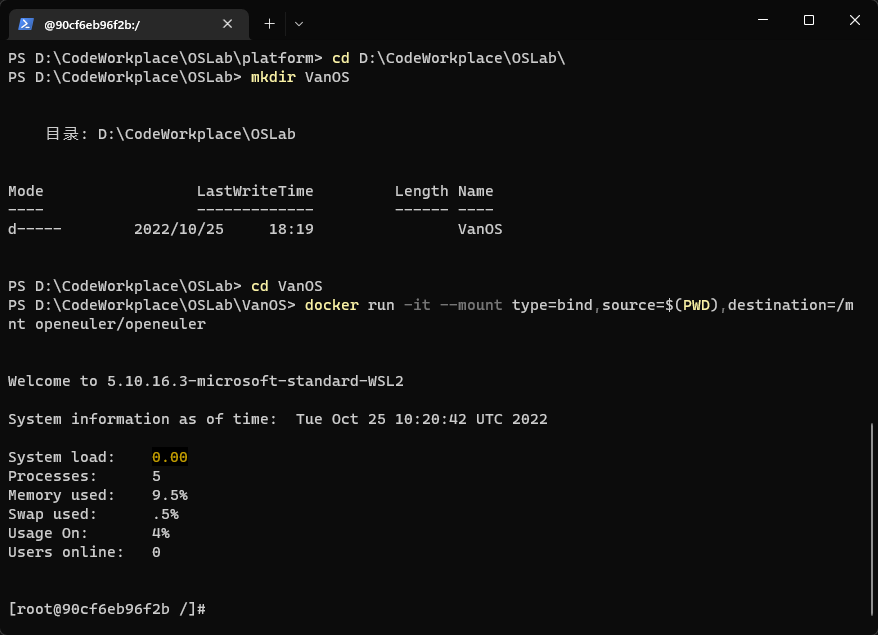

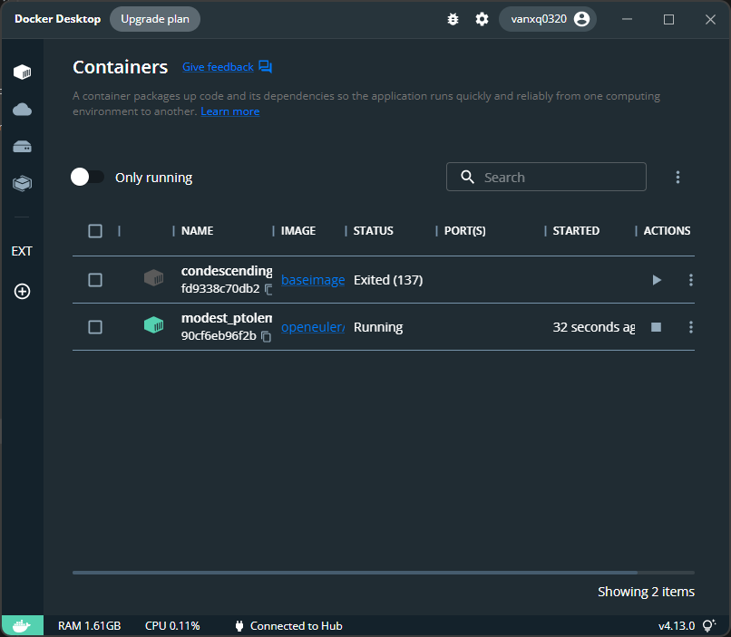

通过如上命令启动容器后，本地创建的实验目录就可以直接通过容器里的/mnt目录直接访问了。

执行完上述命令后，可以在docker desktop查看container的名字，以便后续重新启动。
通过如下命令重新启动以及访问容器。

```sh
docker restart modest_ptolemy
docker attach modest_ptolemy
# 这个简单，不做演示
```

安装一些必要的工具：

```sh
dnf install curl vim gcc 
```

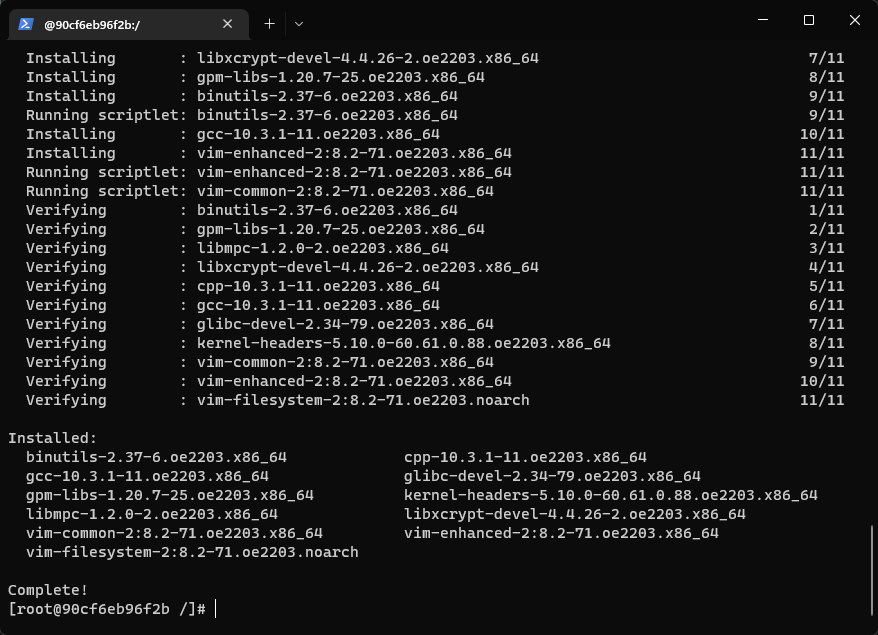

4. 配置Rust开发环境
（1）通过如下命令安装rust。

```sh
cd ~
```

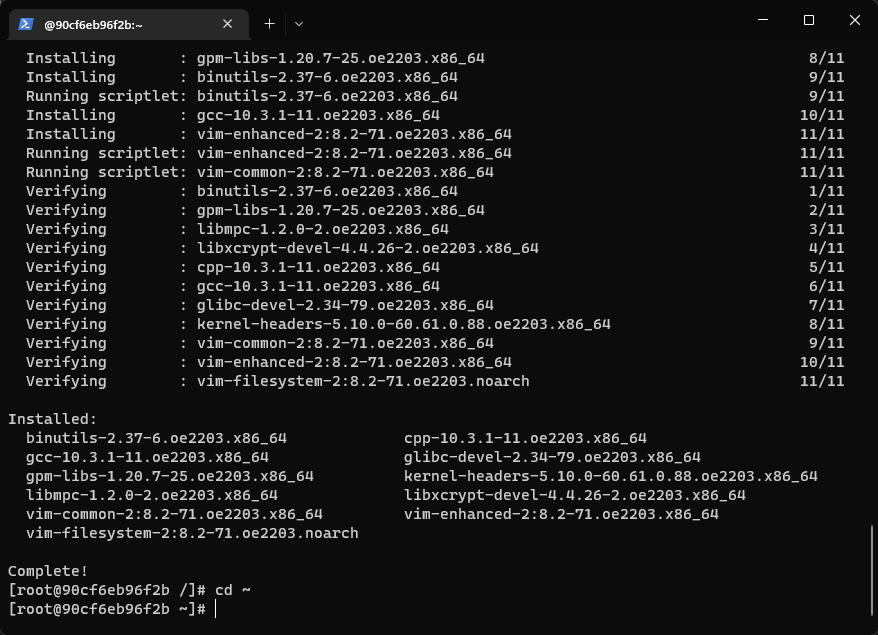

修改.bashrc增加如下内容：

```sh
vim .bashrc
```

```sh
export RUSTUP_DIST_SERVER=https://mirrors.ustc.edu.cn/rust-static
export RUSTUP_UPDATE_ROOT=https://mirrors.ustc.edu.cn/rust-static/rustup
```

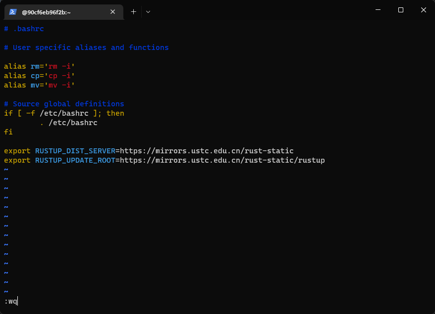

然后，通过如下命令安装rust。

```sh
curl https://sh.rustup.rs -sSf | sh
```

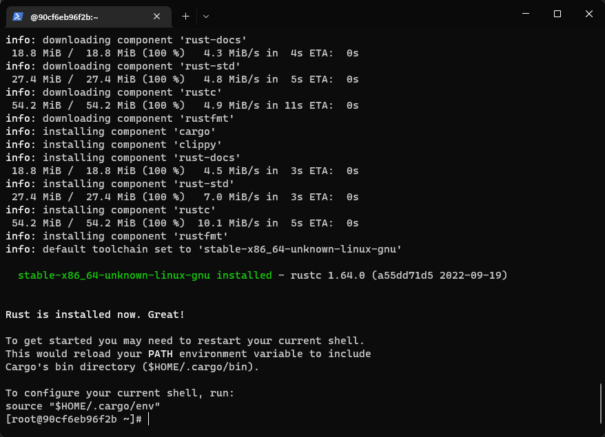

1执行如下命令，使得安装环境启用。

```sh
source "$HOME/.cargo/env"
```

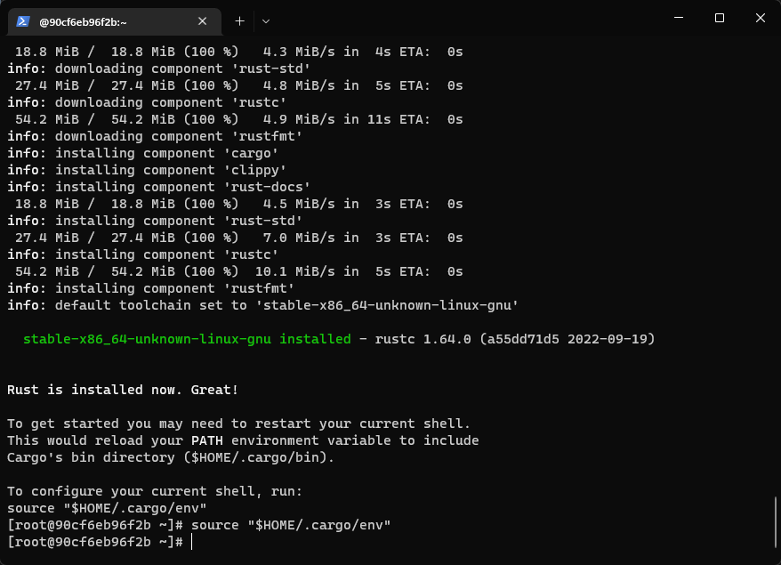

操作系统实验依赖于nightly版本的rust，因此需要安装nightly版本，并将rust默认设置为nightly。
执行如下命令：

```sh
rustup install nightly
rustup default nightly
```

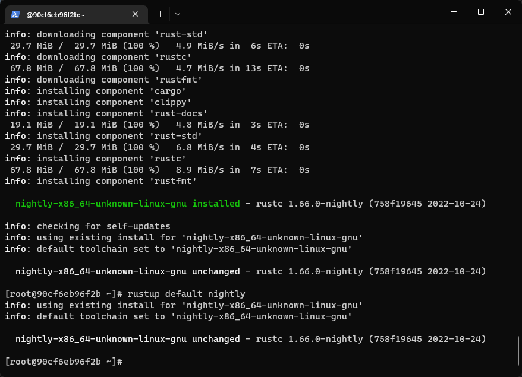

（2）切换cargo软件包镜像为tuna

```sh
vim ~/.cargo/config
```

文件内容如下：

```sh
[source.crates-io]
replace-with = 'ustc'

[source.ustc]
registry = "git://mirrors.ustc.edu.cn/crates.io-index"
```

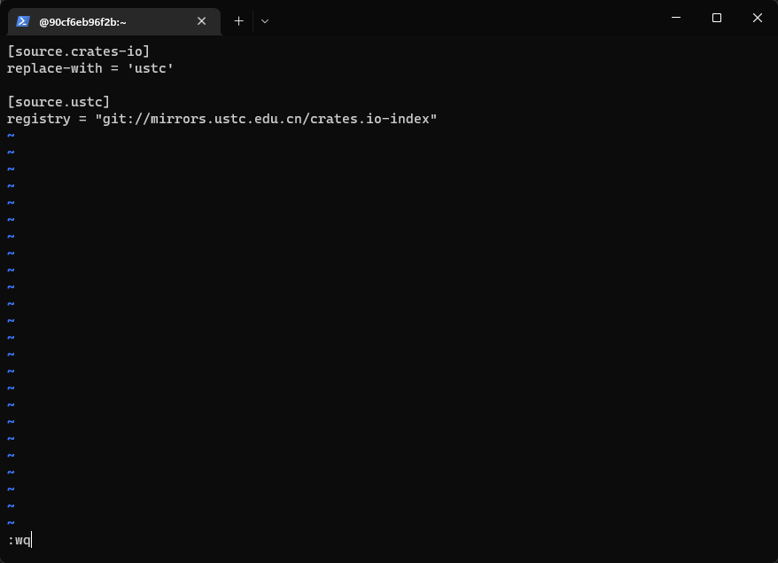

（3）接下来安装一些Rust相关的软件包

```sh
rustup target add riscv64gc-unknown-none-elf
cargo install cargo-binutils
rustup component add llvm-tools-preview
rustup component add rust-src
```

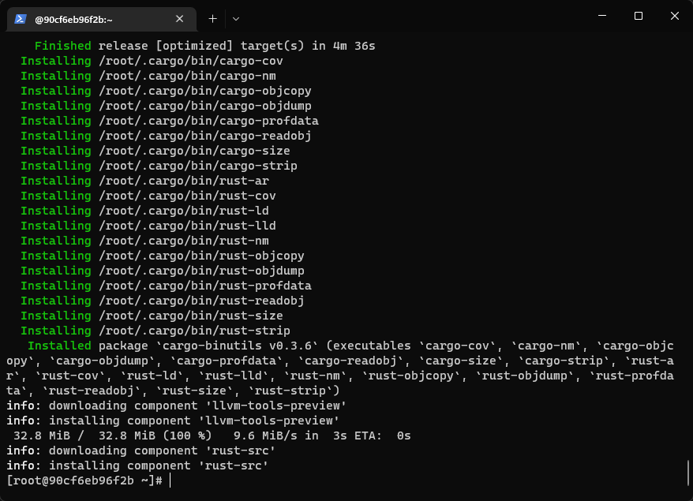

（4）限制rust的版本
在工作目录下创建一个名为 rust-toolchain 的文件，以限制rust的版本，文件内容如下：

```sh
nightly-2022-10-19
```

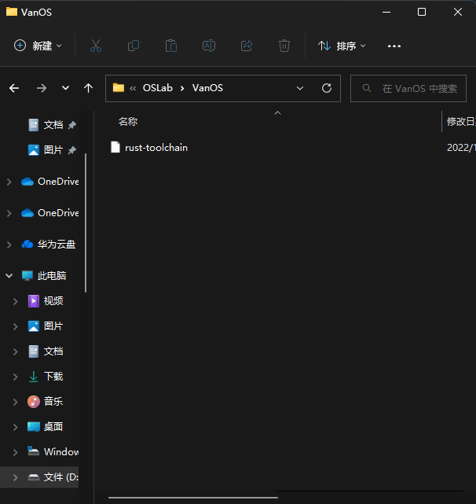

5. 安装qemu

安装qemu5.2
执行如下命令安装基本的软件包。

```sh
dnf groupinstall "Development Tools"
dnf install autoconf automake gcc gcc-c++ kernel-devel curl libmpc-devel mpfr-devel gmp-devel \
              glib2 glib2-devel make cmake gawk bison flex texinfo gperf libtool patchutils bc \
              python3 ninja-build wget xz
```

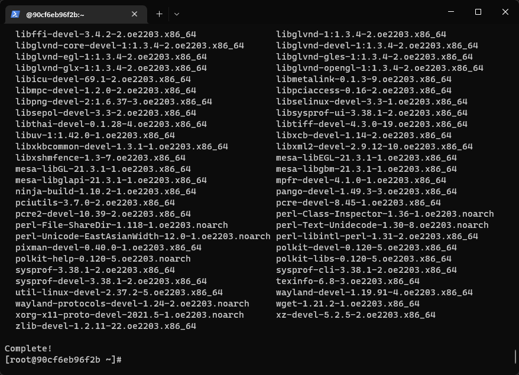

通过源码安装qemu 5.2。

```sh
wget https://download.qemu.org/qemu-5.2.0.tar.xz

tar xvJf qemu-5.2.0.tar.xz

cd qemu-5.2.0
./configure --target-list=riscv64-softmmu,riscv64-linux-user
make -j$(nproc) install
```

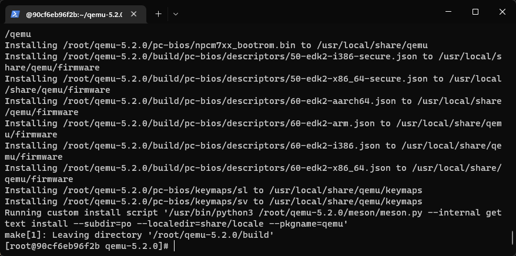

安装完成后可以通过如下命令验证qemu是否安装成功。

```sh
qemu-system-riscv64 --version
qemu-riscv64 --version
```

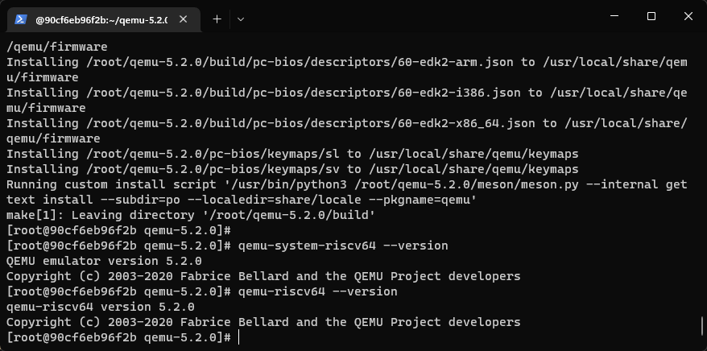

需要说明的是后续的实验都将依赖于上述环境，所以请保证上述环境配置没有问题。

最后，可以通过如下命令把自己配置的环境变成自己的docker镜像。

```sh
docker commit -m "OSLab_base_env" -a "Van_XQ" 90cf6eb96f2bc43af403f35d7abfc0e0c92409c70b0c4090e2f00e003590120c VanOS/openeuler
```

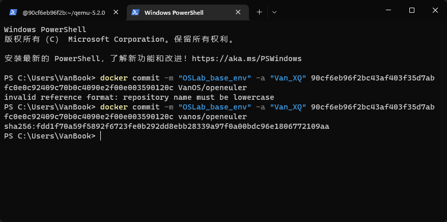

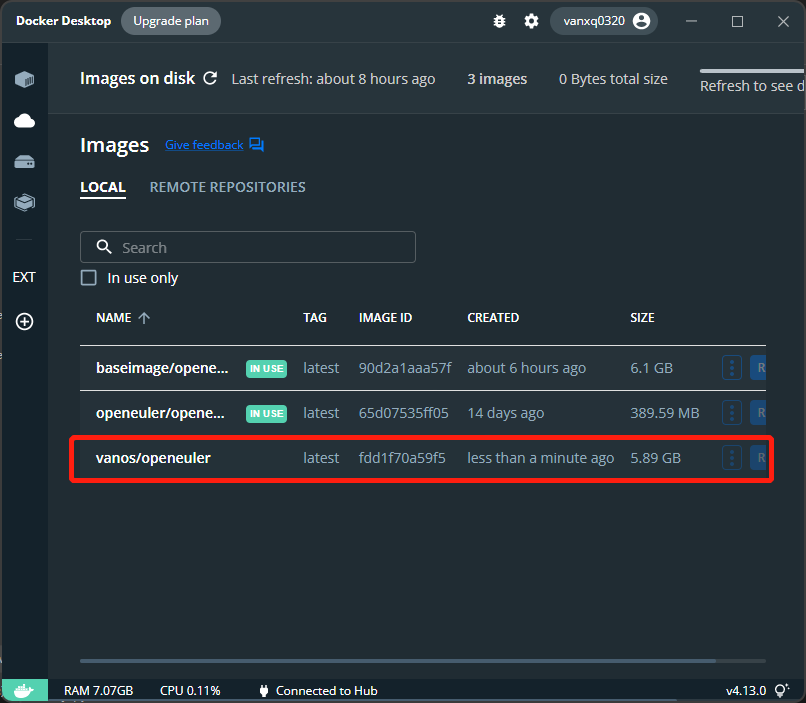

搞定！

## 二、思考问题

没有问题。

## 三、Git提交截图

这次实验应该没什么需要git的吧，那就不写啦

## 四、其他说明

Windows terminal 和 docker 真是伟大的发明。