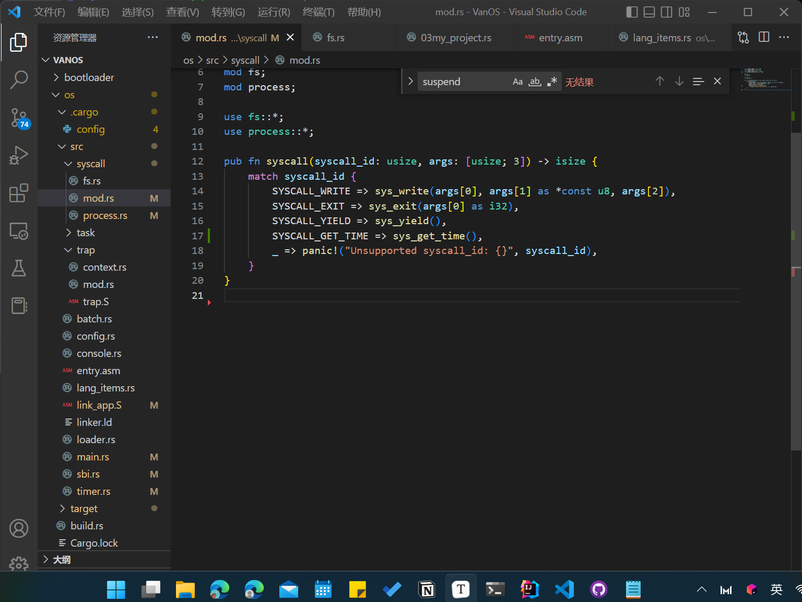
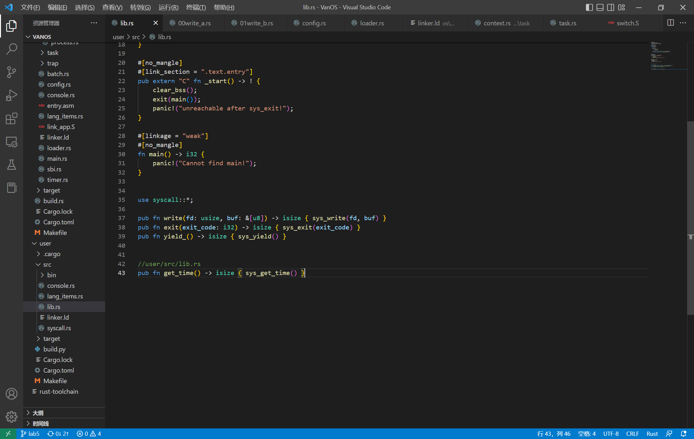
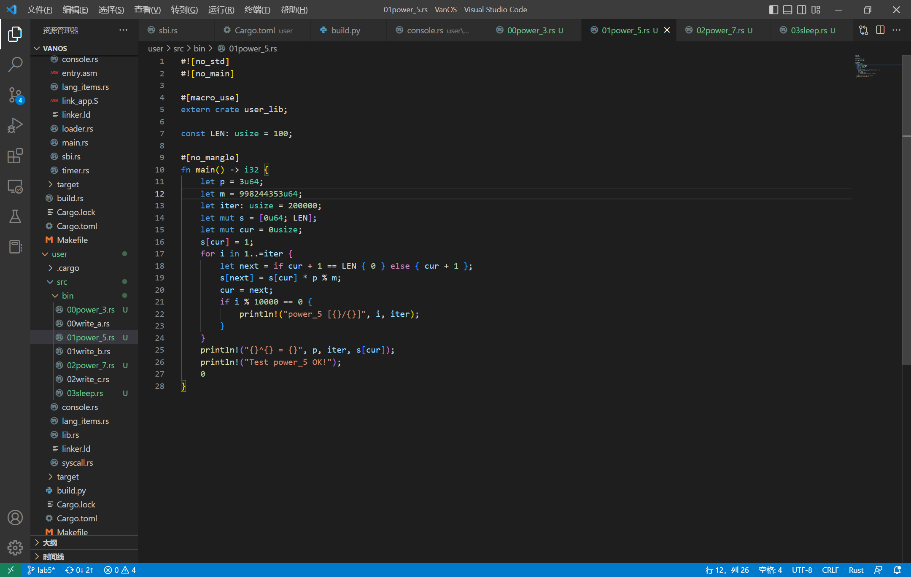
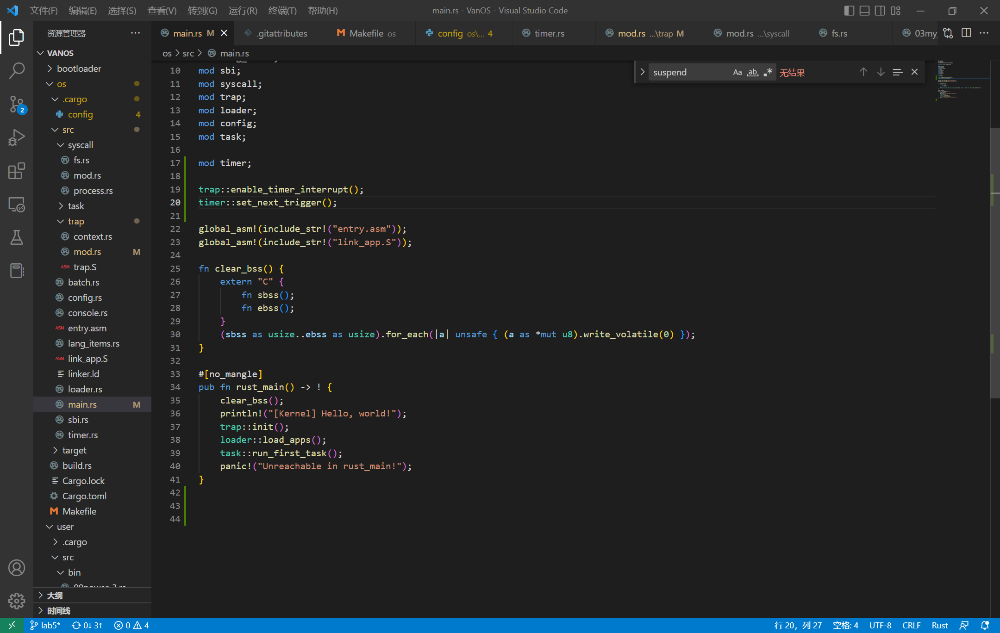
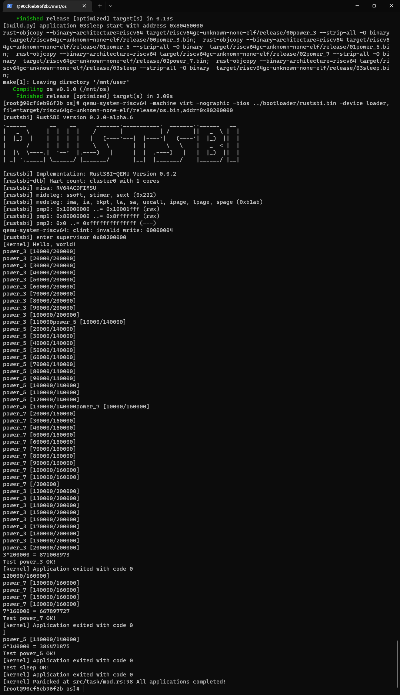
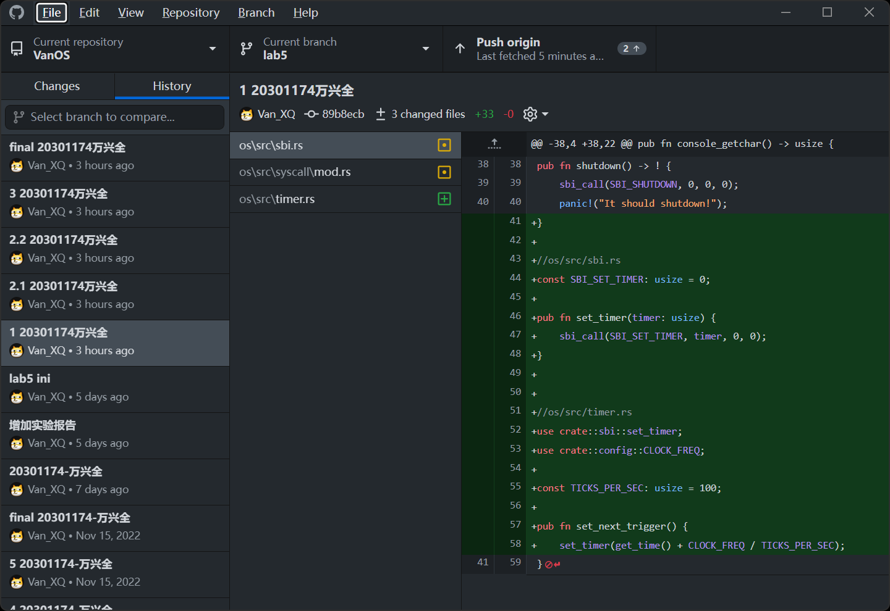
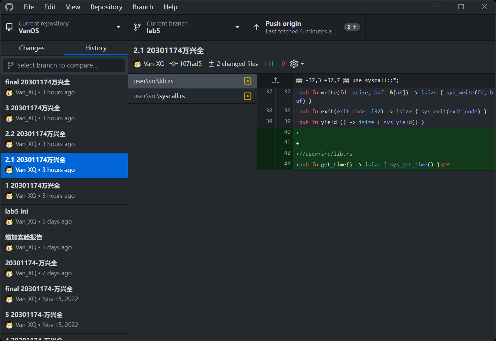
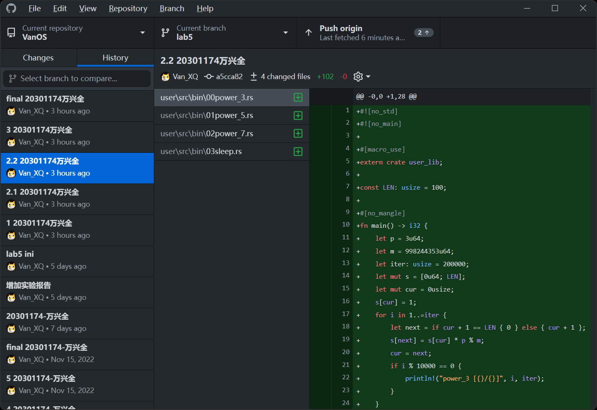
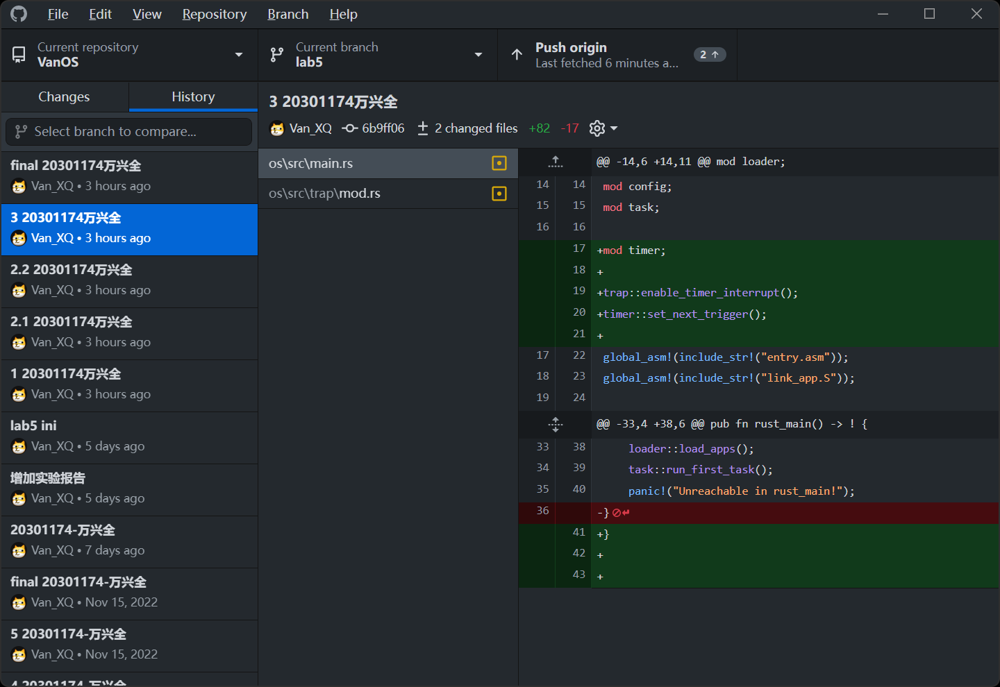
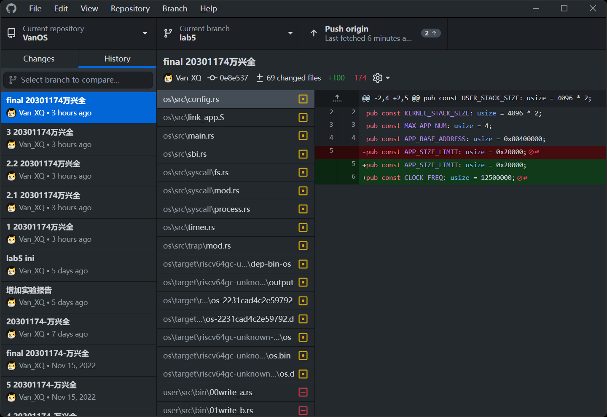

# 2022秋《操作系统》课程实验报告实验-5

20301174-万兴全

仓库链接：[VanXQ/VanOS at lab5 (github.com)](https://github.com/VanXQ/VanOS/tree/lab5)

## 一、实验步骤 

本实验的主要目的是实现一个分时多任务和抢占式调度的操作系统。

1. 时钟中断与计时器

在RISC-V 64架构中，有两个状态寄存器mtime和mtimecmp。其中mtime统计加电以来内置时钟的时钟周期，mtimecmp的是在mtime超过mtimecmp时，触发一次时钟中断。

首先，实现timer子模块获取mtime的值。

```rust
//os /src/timer.rs
use riscv::register::time;

pub fn get_time() -> usize {
    time::read()
}
```


接着，在sbi子模块实现设置mtimecmp的值，并在timer子模块进行封装。

```rust
//os/src/sbi.rs
const SBI_SET_TIMER: usize = 0;

pub fn set_timer(timer: usize) {
    sbi_call(SBI_SET_TIMER, timer, 0, 0);
}


//os/src/timer.rs
use crate::sbi::set_timer;
use crate::config::CLOCK_FREQ;

const TICKS_PER_SEC: usize = 100;

pub fn set_next_trigger() {
    set_timer(get_time() + CLOCK_FREQ / TICKS_PER_SEC);
}
```

同时，为了后续的计时操作，还需要在timer子模块封装另外一个函数，实现以毫秒为单位返回当前计数器的值。

```rust
//os/src/timer.rs
const MSEC_PER_SEC: usize = 1000;

pub fn get_time_ms() -> usize {
    time::read() / (CLOCK_FREQ / MSEC_PER_SEC)
}
```


因为上述两个函数用到了config.rs中的常量，所以还需要修改os/src/config.rs，增加如下内容：
pub const CLOCK_FREQ: usize = 12500000;

最后，还需要修改os/src/syscall子模块，增加get_time系统调用的实现。在os/src/syscall/process.rs增加如下代码：

```rust
use crate::timer::get_time_ms;

pub fn sys_get_time() -> isize {
    get_time_ms() as isize
}
```

同时，注意修改os/src/syscall/mod.rs增加get_time系统调用的处理。具体增加如下代码：

```rust
const SYSCALL_GET_TIME: usize = 169;
SYSCALL_GET_TIME => sys_get_time(),
```




2. 修改应用程序

（1）增加get_time系统调用

首先，在user/src/syscall.rs增加get_time系统调用，具体增加如下代码：

```rust
//user/src/syscall.rs
const SYSCALL_GET_TIME: usize = 169;

pub fn sys_get_time() -> isize {
    syscall(SYSCALL_GET_TIME, [0, 0, 0])
}
```

然后，在user/src/lib.rs增加get_time用户库的封装，增加代码如下：

```rust
//user/src/lib.rs
pub fn get_time() -> isize { sys_get_time() }
```



（2）实现新的测试应用

分别实现00power_3.rs，01power_5.rs，02power_7.rs以及03sleep.rs四个测试应用程序。
其中，00power_3.rs代码如下：

```rust
#![no_std]
#![no_main]

#[macro_use]
extern crate user_lib;

const LEN: usize = 100;

#[no_mangle]
fn main() -> i32 {
    let p = 3u64;
    let m = 998244353u64;
    let iter: usize = 200000;
    let mut s = [0u64; LEN];
    let mut cur = 0usize;
    s[cur] = 1;
    for i in 1..=iter {
        let next = if cur + 1 == LEN { 0 } else { cur + 1 };
        s[next] = s[cur] * p % m;
        cur = next;
        if i % 10000 == 0 {
            println!("power_3 [{}/{}]", i, iter);
        }
    }
    println!("{}^{} = {}", p, iter, s[cur]);
    println!("Test power_3 OK!");
    0
}
```

01power_5.rs，02power_7.rs两个测试应用可以通过简单修改上述代码获得。
03sleep.rs代码如下：

```rust
#![no_std]
#![no_main]

#[macro_use]
extern crate user_lib;

use user_lib::{get_time, yield_};

#[no_mangle]
fn main() -> i32 {
    let current_timer = get_time();
    let wait_for = current_timer + 3000;
    while get_time() < wait_for {
        yield_();
    }
    println!("Test sleep OK!");
    0
}
```




3. 抢占式调度 
	

完成时钟中断和计时器后，就很容易实现抢占式调度了。具体修改os/src/trap/mod.rs代码，具体如下：

```rust
//os/src/trap/mod.rs

use riscv::register::{
    mtvec::TrapMode,
    stvec,
    scause::{
        self,
        Trap,
        Exception,
        Interrupt,
    },
    stval,
    sie,
};

use crate::task::{
    exit_current_and_run_next,
    suspend_current_and_run_next,
};

use crate::timer::set_next_trigger;


pub fn enable_timer_interrupt() {
    unsafe { sie::set_stimer(); }
}

#[no_mangle]
pub fn trap_handler(cx: &mut TrapContext) -> &mut TrapContext {
    let scause = scause::read();
    let stval = stval::read();
    match scause.cause() {
        Trap::Exception(Exception::UserEnvCall) => {
            cx.sepc += 4;
            cx.x[10] = syscall(cx.x[17], [cx.x[10], cx.x[11], cx.x[12]]) as usize;
        }
        Trap::Exception(Exception::StoreFault) |
        Trap::Exception(Exception::StorePageFault) => {
            println!("[kernel] PageFault in application, bad addr = {:#x}, bad instruction = {:#x}, core dumped.", stval, cx.sepc);
            exit_current_and_run_next();
        }
        Trap::Exception(Exception::IllegalInstruction) => {
            println!("[kernel] IllegalInstruction in application, core dumped.");
            exit_current_and_run_next();
        }
        Trap::Interrupt(Interrupt::SupervisorTimer) => {
            set_next_trigger();
            suspend_current_and_run_next();
        }
        _ => {
            panic!("Unsupported trap {:?}, stval = {:#x}!", scause.cause(), stval);
        }
    }
    cx
}
```

这里通过调用suspend_current_and_run_next实现应用的切换。注意这里部分代码是修改，并不是直接新增。

另外，我们还需要在第一个应用执行之前在main.rs中做一些初始化的工作。具体增加如下代码：

```rust
mod timer;

trap::enable_timer_interrupt();
timer::set_next_trigger();
```

至此，支持分时多任务和抢占式调度的操作系统实现完成。





## 二、思考问题

### （1）分析分时多任务是如何实现的；

 risk-v架构有两个寄存器，mtimecmp和ntime。后者保存了时间计数器，前者检测mtime的值，若超过了mtimecmp则触发一次中断，我们可通过设置mtimecmp的值来控制下次中断何时触发,以此来实现时钟的终端和抢占式调度。时钟中断与计时器是在各个模块封装中断函数和计时函数来实现的，抢占式调度是在trap模块中实现计时器终端来实现应用的中断，以此来实现分时多任务。

### （2）分析抢占式调度是如何设计和实现的；

os/src/trap/mod.rs中有一个trap_handler方法，它里面新增分支，这个分支负责：在出发一个S特权级时钟中断时设定一个10毫秒计时器，然后调用suspend_current_and_run_next函数暂停当前的应用，设置计时器激活时钟中断，然后切换执行下一个应用。

### （3）对比上个实验实现的协作式调度与本实验实现的抢占式调度。

协作式调度：如果只要一个应用不主动交出CPU的使用权，它就会一直执行下去。在上个实验中，程序输出了一条信息后yield，下个程序才执行。输出一条信息后便yield，因此结果是轮流打印。

抢占式调度：要求每个应用只能连续执行一定的时间，然后被内核强制切除。本次实验中的3个应用抢占时间片，导致输出无规律可言。

总的来说：协作式调度依靠被调度方主动弃权；抢占式调度则依靠调度器强制将被调度方被动中断。

## 三、Git提交截图











## 四、其他说明

差点忘记提交了~
